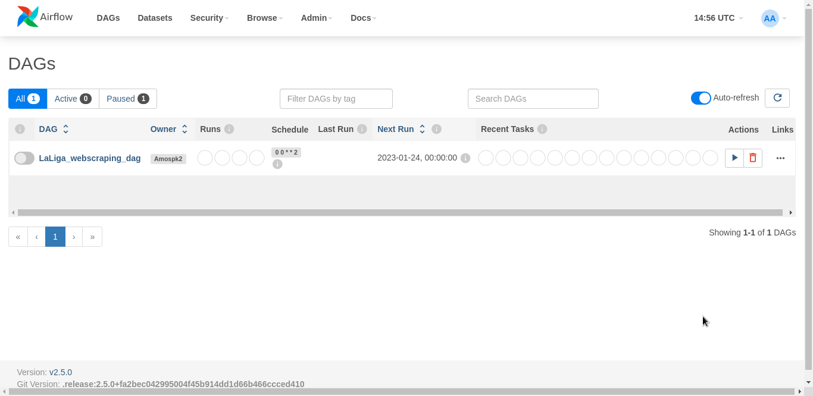
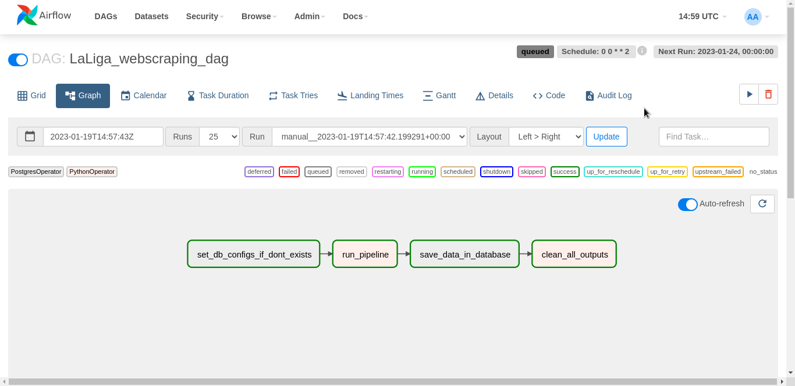

# Usando Airflow para osquestrar uma pipeline

Este projeto consiste num scraping de informações sobre o campeonato espanhol, os times, pontuação
e outras informações. Como esses dados são atualizados constantemente, utilizar o airflow se torna
interessante para rodar a pipeline semanalmente e atualizar suas informações.

##  Rodando o apache airflow 2.0 no docker com LocalExecutor.

1. Clone este repo

2. Cria as pastas necessarias rondando:

```bash 
mkdir ./logs ./plugins
```


3. Instale o docker na sua maquina caso não tenha:
- [Download Docker Desktop Application for Mac OS](https://hub.docker.com/editions/community/docker-ce-desktop-mac)
- [Download Docker Desktop Application for Windows](https://hub.docker.com/editions/community/docker-ce-desktop-windows)
- [Download Docker Desktop Application for Linux](https://docs.docker.com/desktop/install/linux-install/)


4. Agora faça o build da image extendida, com os modulos python que o projeto precisa.
```bash 
docker build . --tag extending_airflow:latest
```

5. Inicie o airflow usando docker-compose
```bash
docker-compose up -d
```
- Caso seja a primeira vez que esteja executando ele criar todos os containers do airflow!

6. Verifique se os containers do airflow estão rodando
```bash
docker ps
```
- Caso algum container do airflow não estiver rodando, execute novamente o passo 5!

7. Abra o navegador e acesse http://0.0.0.0:8080/
- Para acessar o airflow webserver use como login e senha 'airflow'


